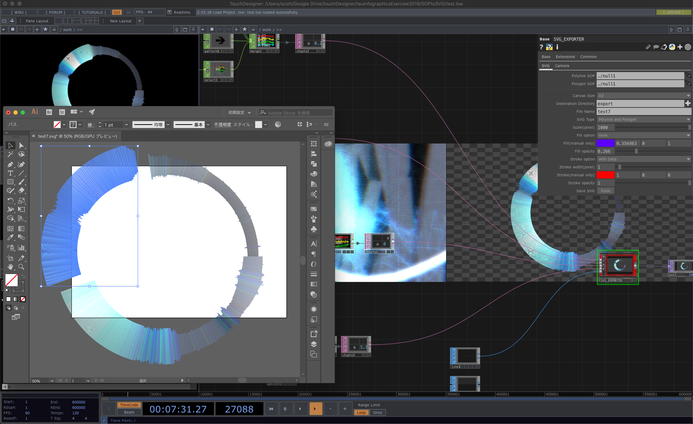

# SVG_EXPORTER
SVG_EXPORTER is data visualization tools for designer inspered by [Matthew Ragan's touchdesigner-sop-to-svg](https://github.com/raganmd/touchdesigner-sop-to-svg).

# Usage
You can find tox in tox/SVG_EXPORTER.tox and, template toe file in template/template.toe, example files in examples/colorGRAPH.toe, colorRING.toe, airports.toe.
1. Connect 4 DATs(color rgba, postition xyz, rotation xyz, scale xyz) and 1 SOP to SVG_EXPORTER.
2. Choose canvas size(Letter, A4, A3, A2).
3. Choose distination directory and file name.
4. choose fill option and stroke option, **you can choose color with Data, manually, none, stroke width as well**.
5. put "save SVG" button.

# Screenshot

# Dependencies (quote from regan's repository)
**TouchDesigner 099** - https://www.derivative.ca/099/Downloads/
This tox is written and maintained in 099.

**SVG Write** - https://pypi.python.org/pypi/svgwrite/
This tox requires the Python library SVG Write to function correctly. If you're familiar with adding external Python libraries in Touch please carry on. If that's a new process to you, I'd recommend that you read through the python documentation on the derivative wiki:  
https://www.derivative.ca/wiki099/index.php?title=Introduction_to_Python_Tutorial

## Adding Dependencies to TouchDesigner
If you'd like to add the modules directly to your TouchDesigner folder you can do that with the following commands

### **Windows**
First install [Python 3.5.1](https://www.python.org/downloads/release/python-351/)  
From the command line `pip install --target=/path/to/your/packages/directory/for/TD package_to_install`  

There's a good chance that looks like:  
From the command line `pip install --target="C:\Program Files\Derivative\TouchDesigner099\bin\Lib\site-packages" svgwrite`

### **MacOS**
First install [Python 3.5.1](https://www.python.org/downloads/release/python-351/)  
`curl https://bootstrap.pypa.io/get-pip.py -o get-pip.py`  
`python3 get-pip.py`  
`python3 -m pip install --target=/Applications/TouchDesigner099.app/Contents/Frameworks/Python.framework/Versions/3.5/lib/python3.5/site-packages svgwrite`
